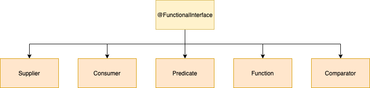

<div align="center">
    
</div>


## Project structure
```
.
├── functional-interfaces
│   ├── pom.xml
│   ...
├── pom.xml
|
└── README.md
```

## Start project

- Build project

```shell script
$ ./mvnw clean package
...
[INFO] 
[INFO] Functional Interfaces .............................. SUCCESS [  7.400 s]
[INFO] Parent ............................................. SUCCESS [  0.014 s]
[INFO] ------------------------------------------------------------------------
[INFO] BUILD SUCCESS
[INFO] ------------------------------------------------------------------------
[INFO] Total time:  7.575 s
[INFO] Finished at: 2022-07-27T08:44:34+07:00
[INFO] ------------------------------------------------------------------------
```

- Run project
```shell script
$java -jar ./functional-interfaces/target/functional-interfaces-0.0.1-SNAPSHOT.jar 
=== Test Consumer ===
Before Java 8:
a       b       c       d       e       

Java 8:
a       b       c       d       e       
=== Test Comparator ===
Before Java 8:
[1, 2, 3, 4, 5, 6, 7]

Java 8:
[1, 2, 3, 4, 5, 6, 7]
=== Test Function ===
Before Java 8:
A       C       B       D       E       

Java 8:
A       C       B       D       E       
=== Test Predicate ===
Before Java 8:
1       3       5       

Java 8:
1       3       5       
=== Test Supplier ===
Before Java 8:
Example

Java 8:
Example
=== Test MethodReference ===
a-b
```

## Reference